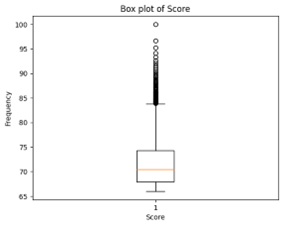
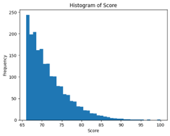
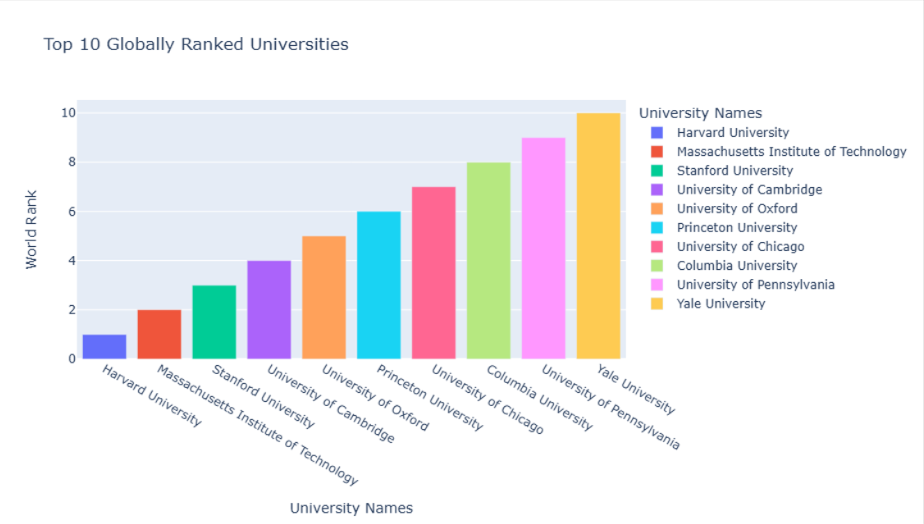

# Usecase-3-Project-2

- The Final presentation will be on Monday.
- Due Date: Mon, 5 Aug, 09:00 AM.
### Final Deliverables:
- Notebook file(.ipynb).
- Presentation of the result in 3 slides
- README.md file.
  ### Team members:
- Alaa Alahmadi
- Musab Alsobhi
- Dania Alshehri
- Wadiah Albuhairi.

  
### Introduction:
Choosing the right university can be overwhelming due to the numerous factors involved in ranking them globally. The "World University Rankings" and “ranking universities in Shanghai” dataset from Kaggle provides detailed information on various aspects of university performance, such as educational quality, employability, faculty strength, research output, and overall scores.
 This study aims to conduct an exploratory data analysis (EDA) to gain insights into the criteria used for “ranking universities in Shanghai” and World University Rankings", such as academic reputation, research output, faculty quality, and international collaboration. By approaching this analysis in a professional manner, we can provide valuable recommendations for universities to strategically enhance their rankings and reputation.

### Problem Statement:
With so many different ranking systems and criteria, it's hard to get a clear picture of which universities truly excel. This dataset helps simplify that by consolidating important ranking factors into one place.

### Objective:
The goal is to use this dataset to answer key questions about university rankings:

1.	Top 10 Global Universities: Identify the top 10 universities worldwide.
2.	Top 10 for Employment: Find the top 10 universities for job outcomes.
3.	Saudi Arabian Universities: See how Saudi universities rank globally.
4.	Key Ranking Factors: Determine which factors most influence a university's overall rank.
5.	National vs. Global Rankings: Explore the relationship between national and global rankings and suggest countries with many top-ranked universities.
6.  Which countries have the most universities in the ranking.
7.  What is the local ranking of Saudi universities.

By answering these questions, we aim to provide clear and useful insights for students, educators, and policymakers.

### Dataset Overview and Source:

The "World University Rankings" dataset provides a comprehensive overview of universities worldwide, capturing various aspects of their performance. The dataset includes the following columns:

1.	World Rank: The global ranking of the university.
2.	University Names: The names of the universities.
3.	Location: The geographical location of the universities.
4.	National Rank: The ranking of the university within its own country.
5.	Educational Rank: The rank based on educational quality.
6.	Employability Rank: The rank based on the employment outcomes of graduates.
7.	Faculty Rank: The rank based on the quality and strength of the faculty.
8.	Research Rank: The rank based on research output and impact.
9.	Score: The overall score that combines various ranking metrics.

### List of EDA steps that applied on data with description:
1-	Data Profiling :
# Descriptive analysis:
 To know structure of data we use :
-	Info (): 
Displays a  summary of the DataFrame, including the number of non-null entries, data types, and memory usage
-	Shape ():
Returns the number of rows and columns.
-	nunique ():
 Provides the number of unique values in each column.
-	duplicated() :
 Identifies duplicate rows in the DataFrame
-	sample (5):
 Returns a random sample of 5 rows from the DataFrame.
-	columns : 
Lists the column names of the DataFrame.
-	dtypes: 
Shows the data types of each column
-	count ():
Returns the number of non-null entries in each column.

# Check data dimensions:

•	Reliability: 
  o	Assess the data source and ensure it is trustworthy.
•	Timeliness: 
  o	Ensure the data is up-to-date
•	 Consistency: 
  o	Verify that similar data across different datasets or columns are consistent.
•	Relevance:
  o	Ensure the data is pertinent to the analysis objectives.
  o	Remove or ignore data that is not relevant to the analysis.
•	Uniqueness:
  o Ensure there are no duplicate entries in the dataset.
•	Completeness:
  o	Ensure that there are no missing values that could impact the analysis.
  o	Fill or handle missing data appropriately.
•	Check Accuracy:
  o	Check data type 
  o	Detect outliers
	
2- Data Cleaning 
-Dealing with Missing Values:
  o We identified missing values in the dataset, represented by -, and replaced them with 0 to ensure consistency and avoid computational issues during analysis.
-Error Correction:
 o First Column Correction: Errors in the first column were rectified, ensuring it now exclusively contains the rank information.
 o Data Type Correction: We corrected the data types across the dataset to ensure proper data handling and accurate analysis.
-Dealing with outliers:
 o Outliers are data points that differ significantly from the rest of the dataset.
 o We use a box plot to visually identify these outliers in the "National Rank" and “Score” data.
 
3- Univariate Analysis:

Bar chart:
 - Top 10 Globally Ranked Universities: This chart displays the top 10 universities worldwide based on their global ranking. 
 - Top 10 Universities for Employment Outcomes: This chart showcases the top 10 universities ranked by their employment outcomes, illustrating which institutions are most effective at preparing students for successful careers.
 - Top 10 USA Universities by National Rank: This chart presents the top 10 universities in the United States based on national rankings.

Histogram:
 - The histogram displays the distribution of scores, showing how scores are spread across different ranges.
Pie chart:
 - The pie chart shows Countries with the Highest Concentration of Top 10 Universities, illustrating which countries have the most top-ranked universities.
 - Top 5 Countries with the Highest Average Scores: This pie chart displays the proportion of average scores among the top 5 countries, showing how these countries compare in terms of average scores.
 
Box plot:
 - Box Plot of Score: This plot shows the distribution of scores, highlighting the median, quartiles, and potential outliers.
 - Box Plot of National Rank: This plot displays the distribution of national ranks, highlighting the median, quartiles, and potential outliers

4-Bivariate/Multivariate Analysis:

Heat map:
 - Rank Factors: This heatmap visualizes the correlation between various ranking factors, highlighting how they relate to each other and their impact on university rankings.

Scatter Chart:
 - The World Rank for Saudi Universities: -  The scatter plot shows that there are a wide gap of global standings among Saudi universites, 3 universites are ranked the highest globally, all within the top 500. The other universities are ranked between 500 and 2000. This highlights that while some Saudi universities are highly competitive internationally, many others have room for improvement.
 - Top 10 Countries: This plot visualizes the top 10 countries based on their university rankings, highlighting their relative standings.
National Rank vs. Score of Saudi Universities: This scatter plot compares national rank with scores for Saudi universities, revealing any correlations between these metrics.
 - The Academic Ranking of World Universities (ARWU): This plot highlights the dominance of American and British universities in global academic rankings.
 - Nacional Rank vs Score of Saudi Universities: The scatter plot shows that most Saudi universities have scores below 70.
 

 ### Describe the final ten insights with their charts:
 1.
 
 
 From the figures above, we can say that there are no outliers, and most universities score between 66 and 74.

 2. 
 
 - Harvard, MIT, Stanford, Cambridge, and Oxford are the leading universities globally, known for their academic excellence.
- Seven of the top ten are from the US, highlighting its strong presence in global higher education.
    
 3.

- Top 10 USA universities by National Rank: The first 5 universities in this chart are in the top 10 global ranking which indicates that the USA are playing a major role in world ranking universities and they have the best educational environments.

4.
 
- The chart shows that the USA dominates with 80% of the data, reflecting its significant influence, while the UK represents 20%, indicating a smaller, though still notable, share.

5.

- Top countries with highest average scores:  This pie chart shows that Netherlands, Switzerland, Denmark, and Singapore have the highest average university scores, each contributing roughly 20% to the top scores in this chart, this means these countries have a strong academic performance compared to others. However, some countries might have only one or a few universities, which can result in a higher average score compared to countries with many universities.
   
6.

- The scatter plot shows that there are a wide gap of global standings among Saudi universites, 3 universites are ranked the highest globally, all within the top 500. The other universities are ranked between 500 and 2000. This highlights that while some Saudi universities are highly competitive internationally, many others have room for improvement.

